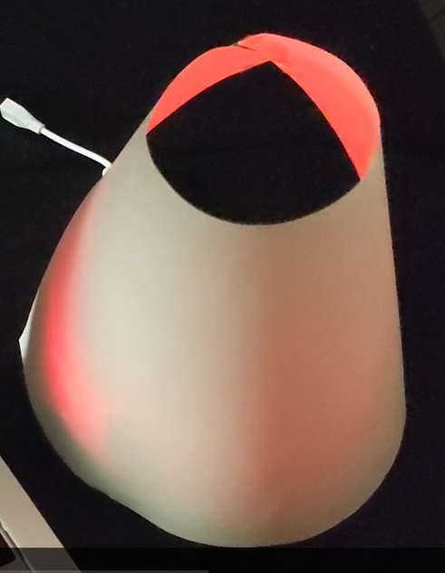

## 何を作ったか                      
                      
講義内で使用したmyledを改造して複数のLEDを扱える様にしました．            
又，ブレッドボードとRaspberryPiの周辺を覆う様に円錐台状に丸めたA4の紙を設置することで，            
簡易照明の様なインテリアとして活用出来るようにしました．                     
  
  
||  
|:---:|  
|*作成したもの*|  
  
  
                      
## 使用環境                      
                      
* RaspberryPi3B+                      
* Ubuntu Server 20.04LTS                      
                      
## インストール方法                      
                      
* 当リポジトリをcloneして下さい．                      
```                
git clone https://github.com/keito1029/myled.git                
```                     
            
* install.shを実行する事で古いデバイスドライバの設定を削除し，一般ユーザが扱える様に設定を更新，反映する事ができます．                   
```                     
sudo sh install.sh                      
```                     
                      
## 操作方法                      
            
* red,blue,green,white,yelloの内，点灯させたいLED色の頭文字を以下の様に入力して実行します．              
                    
```                     
echo r > /dev/myled0                    
```                     
  
||  
|:---:|  
|*redの実行結果*|  
  
|||||  
|:---:|:---:|:---:|:---:|  
|blue|green|white|yellow|  
                      
* 全てのLEDを消灯させたい時は，以下の様にqを入力して実行します．                    
  
                    
```                     
echo q > /dev/myled0                    
```                     
  
||  
|:---:|  
|*quitの実行結果*|  
  
  
    
* purple,ligth blueも操作する事が可能ですが緑の光源が弱い為，上記のwhiteとblueの結果とほぼ同じ様に点灯します．                    
            
## ハード作成方法                     
                    
1. RaspberryPiのLEDを隠す                    
	RaspberryPiのLEDが実行結果に影響しない様にガムテープで覆います	  
  
||  
|:---:|  
  
2. LEDの配置                    
	中央にLEDを寄せる様に配置します．  
  
||  
|:---:|  
  
3. 抵抗の配置                    
	赤LEDに330Ω，青LEDに550Ω，緑LEDに10Ω 抵抗をそれぞれのLEDカソード端子に直列接続します．	  
  
||  
|:---:|  
  
4. GPIOの接続                    
	赤LEDにGPIO25，青LEDにGPIO24，緑LEDにGPIO23をそれぞれのLEDアノード端子に，抵抗にGNDピンをRaspberryPiに接続します．  
  
||  
|:---:|  
  
  
5. シェードの作成と設置                    
	A4用紙を円錐台になるように丸め，テープ等で接着してシェードを作成します．最後に回路とRaspberryPiを覆う様に設置して完成です．	  
  
||||  
|:---:|:---:|:---:|  
|シェード作成|設置|完成|  
                  
   

